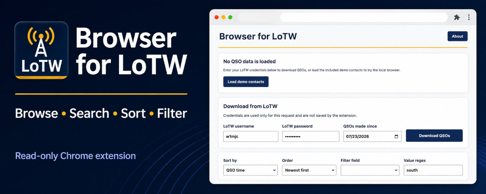
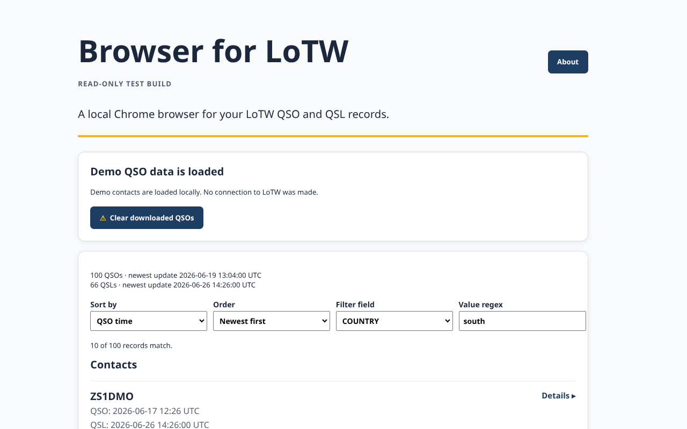
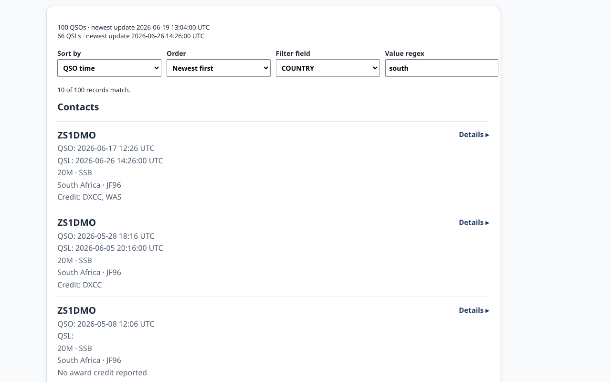
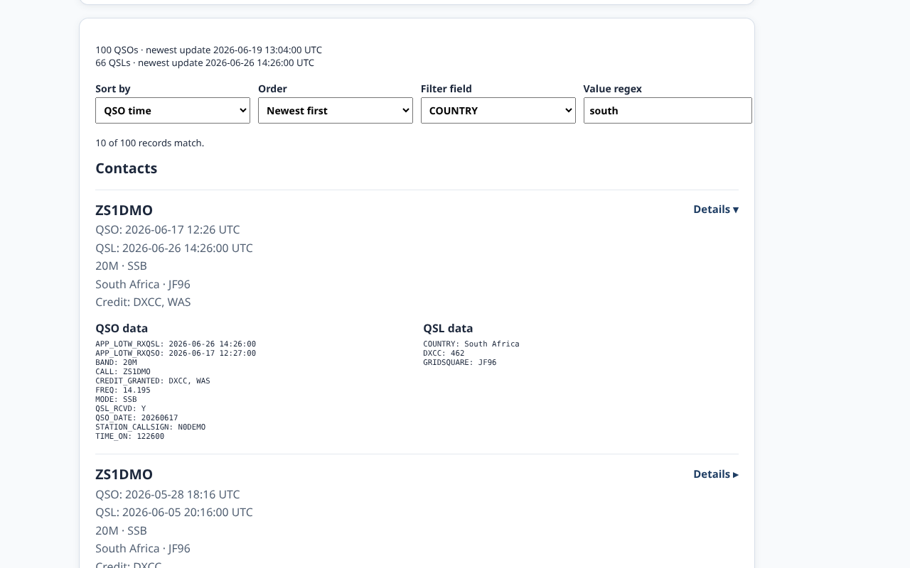
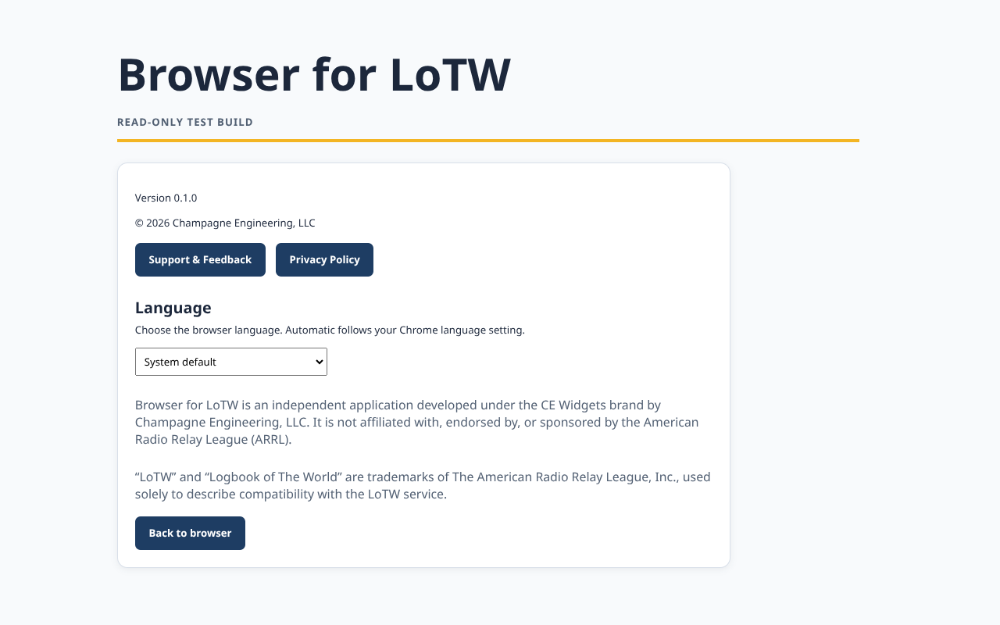
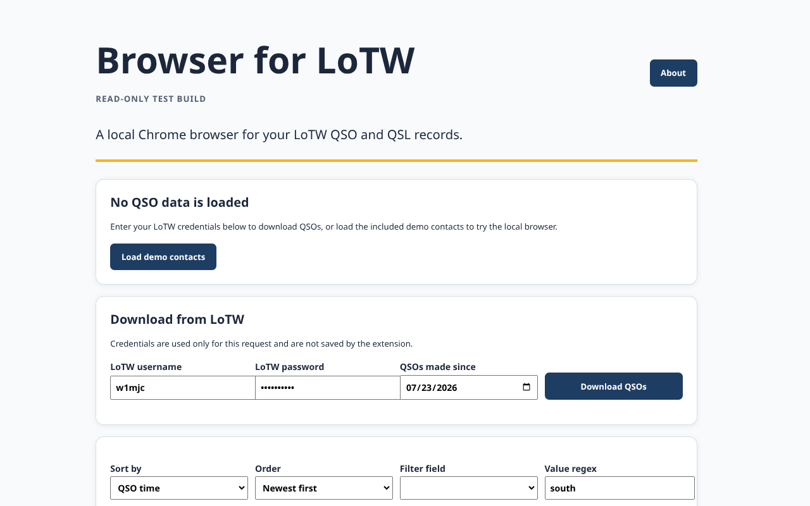

# Browser for LoTW

**Status:** 🟡 Submitted for Chrome Web Store review

## Chrome Web Store

Browser for LoTW will be available from the Chrome Web Store after review is complete.

## Overview

Browser for LoTW is a read-only Chrome extension for browsing, searching, sorting, and filtering ARRL Logbook of The World (LoTW) records. It keeps downloaded records locally for offline browsing. LoTW credentials are used only for each download request and are not stored by the extension.

## Features

- Download LoTW records directly from ARRL
- Browse QSOs and QSLs
- Advanced sorting and filtering
- Regular-expression filtering
- Detailed QSO and QSL views
- Offline browsing and local storage
- Demo mode
- Language selection: English, French, German, Portuguese, and Spanish

## Screenshots

  
  
  
  
  

## Repository Purpose

This public repository is maintained for Browser for LoTW documentation, release notes, and issue tracking. It does not contain the extension source code.

## Documentation

Additional documentation is available in the [docs](docs/) directory.

- [Release Notes](docs/release-notes.md)
- [Product Page](https://champagne.engineering/browser-for-lotw-chrome)
- [Privacy Policy](https://champagne.engineering/privacy)
- [Terms of Service](https://champagne.engineering/tos)

## Support

Website: https://champagne.engineering

Email: support@champagne.engineering

## Copyright and Disclaimer

© 2026 Champagne Engineering, LLC.

Browser for LoTW is an independent application developed under the CE Widgets brand by Champagne Engineering, LLC. It is not affiliated with, endorsed by, or sponsored by the American Radio Relay League (ARRL).

“LoTW” and “Logbook of The World” are trademarks of The American Radio Relay League, Inc., used solely to describe compatibility with the LoTW service.
